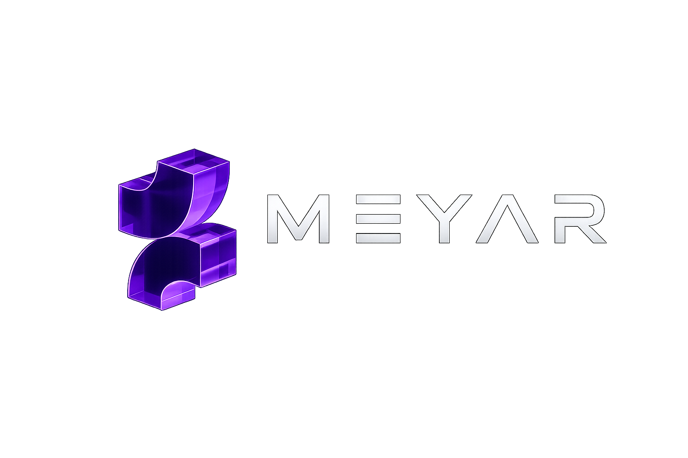

<div align="center">



# MEYAR — LLM Evaluation Platform

**Compare multiple Large Language Models under identical conditions.**  
Upload a dataset or document, select your models, and get structured evaluation metrics — automatically.

[](https://fastapi.tiangolo.com)
[](https://streamlit.io)
[](https://azure.microsoft.com)
[](https://www.python.org)

</div>

---

## What the project does

MEYAR is an **LLM evaluation platform** — not a chatbot.

Given a file uploaded by the user, the platform automatically:

1. **Detects the task type** — Open QA (CSV/XLSX with questions and reference answers) or RAG (a TXT, PDF, or DOCX document).
2. **Runs selected LLMs** (GPT-4o, DeepSeek, Llama, Qwen) on the same inputs under identical conditions.
3. **Evaluates outputs** using a dual evaluation system:
   - **RAGAS** (algorithmic, decomposition-based): Faithfulness, Answer Relevancy, Context Precision, Context Recall — RAG track only
   - **LLM-as-a-Judge** (GPT-5.5, holistic): Coherence, Hallucination, Toxicity — RAG tracks - and all metrics for Open QA.
4. **Surfaces results** as a comparison table, per-metric bar charts, and per-question breakdowns — all exportable as CSV.
5. **Handles foreign or unstructured datasets** (e.g. Chinese customer-service dialogues) by extracting and translating question/answer pairs automatically before evaluation.
6. **Supports prompt iteration** — run the same dataset with two different prompt versions (v1 / v2) and compare results side-by-side.

All runs are persisted in SQLite and accessible from the sidebar.

---

## Architecture

```
User (browser)
      │
      ▼
Streamlit UI  ──── HTTP ────►  FastAPI backend
  :8501                            :8000
                                     │
                          ┌──────────┴──────────────┐
                          │    Task Detection       │
                          │  (Open QA  |  RAG)      │
                          └──────┬─────────┬────────┘
                                 │         │
                    ┌────────────▼──┐  ┌───▼───────────────────┐
                    │  Open QA      │  │  RAG Pipeline         │
                    │               │  │                       │
                    │ load dataset  │  │ load document         │
                    │ normalize cols│  │ chunk + embed         │
                    │ (auto-trans-  │  │ FAISS vector store    │
                    │  late if      │  │ generate Q&A pairs    │
                    │  needed)      │  │ retrieve top-k chunks │
                    └──────┬────────┘  └───────┬───────────────┘
                           │                   │
                           └─────────┬─────────┘
                                     │
                              ┌──────▼────────┐
                              │ Model Router  │
                              │               │
                              │  GPT-4o       │
                              │  DeepSeek     │
                              │  Llama 3.1    │
                              │  Qwen 3       │
                              └──────┬────────┘
                                     │
                              ┌──────▼─────────────┐
                              │  Judge (GPT-5.5)   │
                              │  · Coherence       │
                              │  · Hallucination   │
                              │  · Toxicity        │
                              │    all metrics     │
                              │    for Open QA     │
                              │                    │
                              │  RAGAS (RAG only)  │
                              │  · Faithfulness    │
                              │  · Ans. Relevancy  │
                              │  · Ctx. Precision  │
                              │  · Ctx. Recall     │
                              └──────┬─────────────┘
                                     │
                          ┌──────────▼───────────┐
                          │  SQLite  +  Results  │
                          │  Comparison Table    │
                          │  Bar Charts  +  CSV  │
                          └──────────────────────┘
```

**Cloud deployment** runs on **Azure Container Apps** behind an Application Gateway (WAF v2), provisioned automatically via Terraform on every push to `main`.

---

## Tech stack

| Layer | Tech |
|---|---|
| Orchestration | **LangChain** (RAG chains, prompt templates) |
| Models | **OpenAI** (GPT-4o, judge, embeddings) · **Hugging Face** Inference (DeepSeek, Llama 3.1, Qwen 3) |
| Retrieval (RAG) | **FAISS** + `text-embedding-3-small` over uploaded documents |
| Evaluation | **LLM-as-Judge** (GPT-5.5) for Coherence, Hallucination & Toxicity -all metrics for Open QA · **RAGAS** for Faithfulness, Answer Relevancy, Context Precision & Context Recall |
| API | **FastAPI** + Uvicorn (`main.py`) |
| UI | **Streamlit** (`app.py`) |
| Storage | **SQLite** (per-run history + results) |

---

## Requirements

- **Python 3.13.3**
- An **OpenAI** account & API key — used for GPT-4o, the judge model, and embeddings
- A **Hugging Face** account & access token — used for DeepSeek / Llama / Qwen via the Inference API

**Core libraries** (full pinned list in `requirements.txt`):

| Purpose | Packages |
|---|---|
| Backend / Frontend | `fastapi`, `uvicorn`, `streamlit` |
| LLM framework | `langchain`, `langchain-community`, `langchain-openai` |
| Model providers | `openai`, `huggingface_hub` |
| RAG / Vectors | `faiss-cpu` |
| RAGAS metrics | `ragas` |
| Document loading | `pypdf`, `docx2txt`, `openpyxl` |
| Data handling | `pandas`, `numpy`, `tqdm` |
| Config / secrets | `python-dotenv` |

> `sqlite3` ships with the Python standard library — no separate install needed.

---

## Installation

### 1. Clone the repository

```bash
git clone https://github.com/Shada11haddad/LLM-Eval-model.git
cd LLM-Eval-model
```

### 2. Create a virtual environment

```bash
python -m venv venv
source venv/bin/activate        
```

### 3. Install dependencies

```bash
pip install -r requirements.txt
```

---

## Environment variables

Create a `.env` file in the project root (never commit this file):

```env
OPENAI_API_KEY=sk-...
HF_TOKEN=hf_...
```

| Variable | Required | Purpose |
|---|---|---|
| `OPENAI_API_KEY` | ✅ Yes | GPT-4o inference, judge model (GPT-5.5), text-embedding-3-small |
| `HF_TOKEN` | ✅ Yes | DeepSeek / Llama / Qwen via Hugging Face Inference Providers |


---

## Running the project

**Terminal 1 — FastAPI backend:**

```bash
uvicorn src.api.main:app --reload 
```

**Terminal 2 — Streamlit frontend:**

```bash
streamlit run src/app/app.py
```


---

## Using the platform

### 1. Upload your file

| Format | Task |
|---|---|
| `.csv` / `.xlsx` with `question` + `answer` columns | Open QA |
| `.txt` / `.pdf` / `.docx` (document) | RAG — questions are generated automatically |
| Any CSV/XLSX with non-standard or foreign-language columns | Auto-normalised using the judge model |

### 2. Select models

Choose one or more from: **DeepSeek**, **Llama 3.1**, **Qwen 3**, **GPT-4o**.

### 3. Advanced options (optional)

Expand the **Advanced options** panel to customise:

| Option | Description |
|---|---|
| Number of questions | How many questions to evaluate (RAG: controls synthetic generation; Open QA: random sample size) |
| Chunk size | Token size per document chunk (RAG only) |
| Chunk overlap | Overlap between consecutive chunks (RAG only) |

### 4. Rank models by your priorities (optional)

| Option | Description |
|---|---|
| Priority metric | The metric to rank models by results are sorted according to your chosen metric (constraint-based selection) |

### 5. Run evaluation

Click **Run evaluation**. The platform uploads the file, starts evaluation in the background, polls for completion, and displays results automatically.

### 6. Results

| Section | Location |
|---|---|
| Metadata (task type, run ID, cost) | Top of the main page |
| Comparison table (all metrics averaged) | Main page |
| Per-metric bar charts (3 per row) | Main page |
| Per-question answers + judge verdicts | **Results detail** page (sidebar) |
| CSV export | Bottom of the main page |


### 7. Past runs

Any previous run is accessible from the sidebar by clicking its dataset name.

---

## Project structure

```
LLM-EVAL-PLATFORM/
├── scripts/
│   └── prompt_iteration.py
├── src/
│   ├── api/
│   │   └── main.py
│   ├── app/
│   │   ├── assets/
│   │   │   └── meyar.png
│   │   └── app.py
│   ├── evaluation/
│   │   ├── judge.py
│   │   ├── metrics.py
│   │   ├── parse_verdict.py
│   │   ├── ragas_eval.py
│   │   └── run_eval.py
│   ├── generation/
│   │   ├── clients.py
│   │   ├── model_router.py
│   │   └── qa_generation.py
│   ├── ingestion/
│   │   ├── chunker.py
│   │   └── loader.py
│   ├── retrieval/
│   │   ├── retriever.py
│   │   └── vectorstore.py
│   ├── storage/
│   │   └── database.py
│   └── utils/
│       └── helpers.py
├── .env
├── config.py
├── Dockerfile
├── README.md
└── requirements.txt
```

---

## Cloud deployment (Azure)

The project ships with a full Terraform + GitHub Actions pipeline.

### One-time setup

Add the following secrets to your GitHub repository  
(**Settings → Secrets and variables → Actions**):

| Secret | Description |
|---|---|
| `AZURE_CLIENT_ID` | Service principal application ID |
| `AZURE_CLIENT_SECRET` | Service principal client secret |
| `AZURE_SUBSCRIPTION_ID` | Target Azure subscription |
| `AZURE_TENANT_ID` | Azure AD tenant ID |
| `DOCKERHUB_USERNAME` | Docker Hub username |
| `DOCKERHUB_TOKEN` | Docker Hub access token |
| `OPENAI_API_KEY` | OpenAI key (injected as container secret) |
| `HF_TOKEN` | HuggingFace token (optional — omit to disable HF models) |

### Deploy

```bash
git push origin main
```

GitHub Actions builds the Docker image, pushes it to Docker Hub, and runs `terraform apply` automatically. Deployment URLs are printed at the end of the pipeline run:

| Output | Value |
|---|---|
| `api_url` | `http://<public_ip>` |
| `api_docs_url` | `http://<public_ip>/docs` |
| `streamlit_url` | `https://llm-eval-streamlit.<region>.azurecontainerapps.io` |


---

## Limitations & known issues
 
### What did not work or is still incomplete
 
| Issue | Detail |
|---|---|
| Local model for dataset normalisation | Using a local open-weight model for the normalisation step was unreliable — it produced truncated JSON, occasional empty responses, and left some rows untranslated. The step now uses the OpenAI judge model instead. Normalisation with a local model remains a known limitation. |
| HuggingFace empty responses | HuggingFace Inference occasionally returns empty responses, which silently drops a small number of rows from a run. There is no automatic retry yet. |
| Wide-format SQLite schema | Results are stored in a wide-format schema with paired columns per model, which is harder to extend than a long format. The database currently keeps only the latest run per track rather than a full history. |
| RAGAS dependency conflict | `ragas` has a known conflict with modern `langchain-community` versions (GitHub Issue #2741). The current install pins compatible versions — do not upgrade `langchain-community` independently. |
| Auto-normalisation cap | Foreign or unstructured datasets are capped at 50 rows during auto-normalisation to control cost and latency. |
| Prompt iteration is manual | Prompt versions (v1 / v2) are defined directly in `scripts/prompt_iteration.py`. Automated prompt optimisation (GEPA) is planned for a future release. |
| Items not built from the original proposal | The frontend moved from React to Streamlit; MLflow was not used; multi-agent evaluation and an automated fine-tuning dataset generator were left out of scope. |
| Resource group name is pinned | The Terraform resource group `llm-eval-rg` must not be renamed. Changing it forces a full destroy + recreate of all Azure infrastructure (~5 minutes). |
 
### What we would improve next
 
- Migrate results to a **long-format schema** (one row per question and model) and keep a full run history instead of overwriting the latest run.
- Add **automatic retries** to the HuggingFace inference path to recover rows lost to empty responses.
- Expand the set of **domain datasets** and revisit the remaining stretch goals — in particular multi-agent evaluation and generating a fine-tuning dataset from evaluation failures.
---